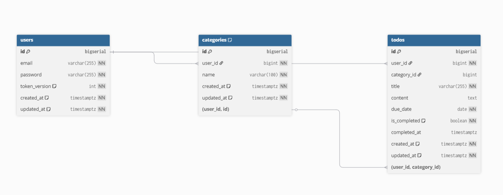

# 📋 다중 사용자 Todo 관리 웹 애플리케이션

## 1. 프로그램 소개
본 프로젝트는 **다중 사용자 환경에서 안전하게 동작하는 Todo 관리 웹 애플리케이션**입니다. 단순한 할 일 목록 구현이 아니라, 아래의 요소들을 **단계적으로 쌓아 올리며**, “기능이 동작하는 것”을 넘어 **구조적으로 안정적인 서비스**를 만드는 것을 목표로 했습니다.

* **핵심 키워드:** DB 무결성, 인증/인가, API 설계, 프론트엔드 연동

> **본 프로젝트는 다음과 같은 질문을 중심으로 개발되었습니다.**
> * 여러 사용자가 동시에 사용하는 환경에서 데이터는 어떻게 분리되어야 하는가?
> * 인증이 끝난 이후에도, 실수로 다른 사용자 데이터에 접근할 수 있는 여지는 없는가?
> * 기능을 빠르게 만드는 것보다, 유지보수와 확장에 유리한 구조는 무엇인가?
>
> 이 프로젝트는 이러한 질문에 대한 답을 **코드와 구조로 풀어낸 결과물**입니다.

---

## 2. 프로젝트 개요

### ✅ 핵심 목표
* 다중 사용자 환경에서 **인가 기반 Todo 관리 기능 제공**
* DB 레벨부터 프론트엔드까지 **데이터 무결성과 사용자 경계 유지**
* 실제 사용 시나리오를 기준으로 한 **단계적 설계 및 검증**

### 🔄 전체 흐름
1. **DB 설계** (무결성 / 인덱스 / 제약조건)
2. **인증/인가 구조 설계** (Access / Refresh Token)
3. **Categories / Todos CRUD 구현**
4. **Postman 기반 설계 검증**
5. **프론트엔드 API 분리 및 연동**
6. **실제 UI 기준 UX·데이터 흐름 정합성 검증**

---

## 3. 기술 스택

| 구분 | 기술 요소 | 상세 설명 |
| :--- | :--- | :--- |
| **Backend** | Node.js, Express, PostgreSQL, Redis | JWT (Access / Refresh Token) 인증 체계 |
| **Frontend** | React, SCSS (SASS) | Partial 구조 기반 스타일 설계 및 레이아웃 보조 |
| **Tooling** | Postman, Git / GitHub | API 설계 검증 및 버전 관리 |

---

## 4. ERD 및 테이블 설계 설명



### 💡 핵심 설계 원칙
* 사용자 데이터는 반드시 **user_id 기준으로 분리**
* 인가를 코드에만 의존하지 않고, **DB 제약 조건으로도 안전장치 구성**
* Todo 서비스 특성상 조회가 많아, **조회 패턴 중심 인덱스 설계**

### 🗂️ 주요 테이블
* **users:** 사용자 계정 정보 (`token_version` 컬럼을 통해 refresh 토큰 무효화 가능)
* **categories:** 사용자별 카테고리 관리 (`(user_id, name)` UNIQUE 제약으로 사용자 단위 중복 방지)
* **todos:** 할 일 관리 테이블
    * `due_date`를 DATE 타입으로 관리하여 날짜 기반 조회에 최적화
    * `is_completed` + `completed_at` 구조로 완료 상태와 시간 정보 분리

### 🔒 핵심 제약 조건
* **todos → categories (복합 FK):** `(user_id, category_id)`
* **설계 의도:** 다른 사용자의 카테고리를 참조하는 구조 자체를 DB 레벨에서 차단

---

## 5. Redis 사용 방식
Redis는 **Refresh Token 관리와 인증 안정성 확보**를 위해 사용했습니다.

### 🎯 사용 목적
* Refresh Token 저장 및 서버 재시작 시 세션 상태 유지
* 로그아웃 또는 토큰 무효화 시 강제 무효화 가능

### ⚙️ 동작 흐름
1. **로그인 시:** Refresh Token 발급 후 Redis에 `{ userId: refreshToken }` 형태로 저장
2. **Access Token 만료 시:** `/auth/refresh` 요청 시 Redis에 저장된 토큰과 비교
3. **로그아웃 시:** Redis에서 해당 Refresh Token 제거

---

## 6. 핵심 기능

### 🔐 인증 / 인가
* JWT 기반 Access / Refresh Token 처리
* refresh 기반 로그인 유지 UX 구현
* 모든 보호 API는 인증 미들웨어 하위에서만 동작

### 📂 Categories 관리
* 사용자 단위 카테고리 생성 / 수정 / 삭제
* 카테고리 삭제 시 Todo는 유지되는 정책 적용 (`ON DELETE SET NULL`)

### 📝 Todos 관리
* Todo 생성 / 수정 / 삭제 및 완료 토글 (`is_completed`, `completed_at`)
* 날짜 기반 필터 기능 제공 (today, week, incomplete)

### 🔗 프론트엔드 연동
* API 호출 로직 분리 (`categoriesApi`, `todosApi`)
* **axios 인터셉터를 통한 인증 로직 캡슐화:** 인증 토큰 처리를 API 계층에 중앙화하여 컴포넌트가 UI 로직에만 집중할 수 있는 구조 설계

---

## 7. 주요 설계 판단 및 트레이드오프

1. **Categories를 Todos보다 먼저 구현:** 빠른 기능 구현보다 인가 흐름 검증을 우선함
2. **모든 쿼리에 user_id 조건 명시:** 쿼리 레벨에서 사용자 범위를 이중으로 제한
3. **날짜 필터를 프론트가 아닌 API에서 처리:** 데이터 의미는 도메인/DB 책임이라고 판단
4. **accessToken을 localStorage에 저장하지 않음:** XSS 공격 위험을 고려하여 refresh 기반 세션 복구 방식 선택

---

## 8. 프로젝트 실행 방법

### 🚀 Backend
```bash
npm install
npm run dev
```


### 💻 Frontend
```bash
npm install
npm run dev
```

 http://localhost:5173/ 으로 접속


## 9. 마무리

이 프로젝트는 단순히 Todo 기능을 구현하는 데서 끝나지 않고,  
**“다중 사용자 환경에서 어떻게 안전한 구조를 만들 것인가”**에 대한 고민을 중심으로 진행되었다.

기능을 빠르게 늘리기보다는  
한 단계씩 구조를 검증하며 쌓아 올리는 방식을 선택했고,  
그 과정 자체를 README에 기록했다는 점이 이 프로젝트의 가장 큰 특징이다.
