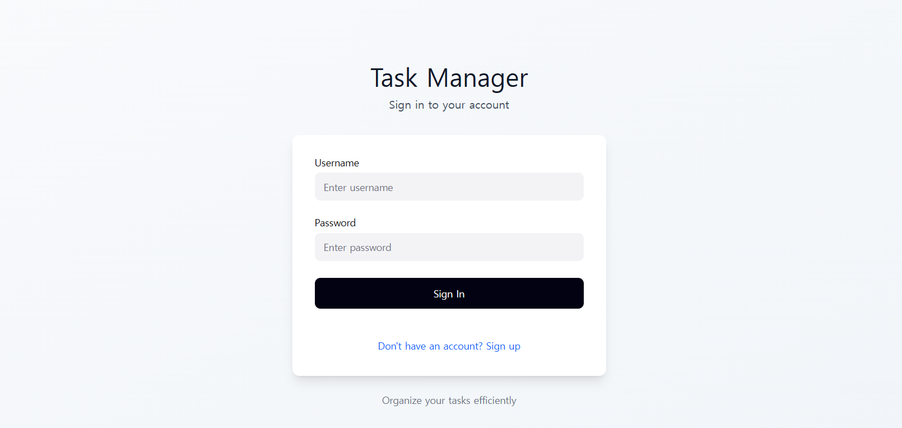
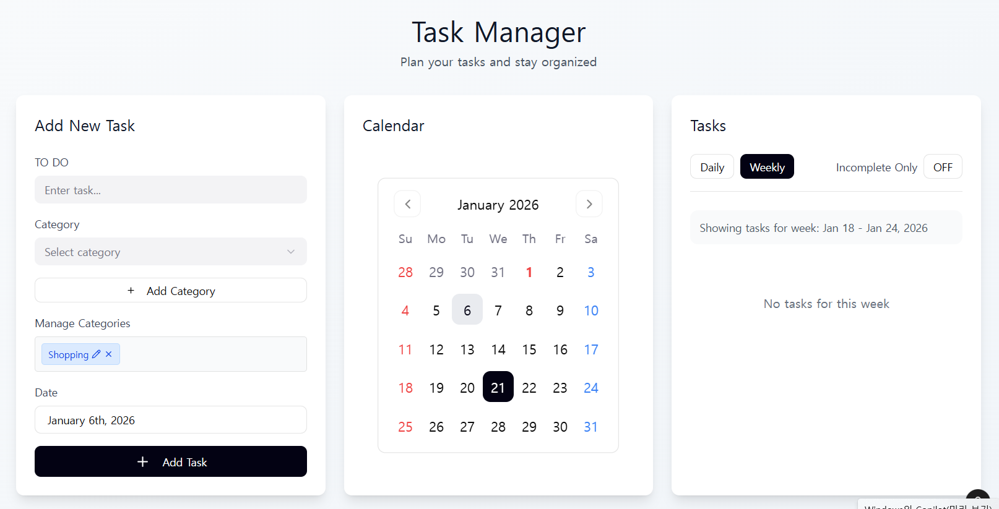

## 1/7 작업 정리 — 인증 이후 프론트엔드 연동 및 구조 안정화

1/7에는 **기능을 더 만드는 것보다**,

이미 만들어 둔 인증/인가·CRUD 구조가 **프론트엔드까지 동일한 의미로 전달되는지**를 검증하고,

프론트 구조를 그에 맞게 안정화해서 구현하는데 목표를 맞췄다.

---

### 1. 화면 구현 전에 다시 점검한 기준

프론트엔드 작업을 시작하기 전, 다음 문제들이 생길 거라고 예상했다.

- 날짜 기반 조회(today / week)와 캘린더 UI 간 불일치
- 사용자별 데이터 분리가 “눈에 보이지 않아” 혼동이 생기는 문제
- 프론트 가공 로직 때문에 백엔드 설계 의도가 깨질 가능성

그래서 **화면부터 만들지 않고**,

“인가 흐름과 데이터 흐름이 프론트까지 정확히 전달되는지”를 먼저 검증하기로 했다.

---

### 2. 프론트엔드 인증 흐름 검증 (Access / Refresh 전달 확인)

가장 먼저 확인한 것은 

- accessToken이 실제로 모든 API 요청에 포함되는지
- refreshToken 기반 세션 복구가 앱 시작 시 정상적으로 동작하는지
- 계정이 바뀌면 API 응답 데이터도 함께 바뀌는지

이를 위해 단순히 “요청 성공/실패”만 보지 않고,

- App 시작 시 `/auth/refresh`가 자동으로 호출되는지
- refresh 성공 후 accessToken이 메모리(tokenStore)에 세팅되는지
- 그 이후 `/categories`, `/todos` 요청이 **인가된 사용자 기준으로만** 동작하는지

를 **Network 로그 기준으로 하나씩 확인했다.**

이 과정을 통해 백엔드에서 설계한 Access / Refresh 기반 인증 구조가 프론트엔드에서도 **같은 의미로 전달되고 있음**을 확인했다.

---

### 3. 트러블 슈팅 : 로그인 유지 UX 문제 인식과 구조적 해결

초기 구조에서 accessToken은 메모리에만 저장되어 있었다.

이 자체는 보안 측면에서 의도한 선택이었지만, **새로고침(F5)** 을 하면

- 실제로는 로그인 상태인데
- 새로고침하면 accessToken이 초기화되어
- 일시적으로 로그인 상태를 판단할 수 없는 화면 전환 문제가 발생했다.

이건 **사용자 경험 관점에서 혼란을 주는 구조**라고 판단했다.

#### 고려했던 선택지

1. accessToken을 localStorage에 저장  
   → 구현은 쉽지만 XSS 리스크가 큼  

2. accessToken까지 쿠키로 관리  
   → 구조가 완전히 바뀌고 현재 설계와 일관성이 깨짐  

3. accessToken은 메모리 유지 + refresh로 복구  
   → 보안과 UX의 균형이 가장 적절  

최종적으로 **3번을 선택**했다.

그래서 다음 구조를 고정했다.

- accessToken은 tokenStore(메모리)에만 저장
- refreshToken은 HttpOnly 쿠키 + Redis로 서버가 관리
- App 시작 시 `/auth/refresh`를 한 번 호출
- 복구가 끝난 뒤에만 라우터 판단

이를 위해 App에 `booting` 상태를 두고,

세션 복구가 끝나기 전까지는 ProtectedRoute가 판단을 보류하도록 구성했다.

결과적으로 **새로고침해도 로그인 상태가 자연스럽게 유지되는 UX**를 만들 수 있었다.

---

### 4. 프론트엔드 구조 설계 — 역할 단위 분리

프론트 구조를 설계할 때 가장 중요하게 본 기준은

**“페이지 단위가 아니라 역할 단위”**였다.

API 통신 로직이 화면 코드와 섞이면 규모가 커지는 순간 유지보수가 무너진다고 판단했다.

그래서 구조를 다음 기준으로 고정했다.

- API 통신: `src/api`
    - apiClient (axios 인스턴스 + interceptor)
    - authApi / categoriesApi / todosApi
- 공통 UI: `components/common`
- 도메인 UI: calendar, layout 등 역할별 컴포넌트
- 페이지: Auth / Todos
- 라우팅과 보호 로직: routes

---

### 5. SCSS 설계 — 스타일이 아니라 구조로 접근

프론트엔드 구현에 들어가기 전,

먼저 **Figma를 통해 전체 화면 구조와 UI 흐름을 설계**했다. 

예쁘게 보이는 화면이 아니라, 

- 어떤 화면이 어떤 역할을 가지는지
- 공통 UI와 페이지 전용 UI가 어디서 나뉘는지
- 사용자 행동에 따라 화면이 어떻게 바뀌는지

같은 구조적 기준에 따라서 설계하고 최대한 적은 클릭수와 화면전환으로 사용자 흐름을 가져가려고 했다. 

또한, 이 작업을 통해

> “이 구조를 코드로 만들 때, CSS는 어떤 단위로 관리해야 할까?”

를 생각해보았고

버튼, 토글, 캘린더처럼 **여러 화면에서 반복되는 요소**와  
TodoPage처럼 **특정 페이지에서만 쓰이는 레이아웃**이 명확히 구분이 되었다. 

그 결과, SCSS를 디자인 도구가 아니라 구조를 표현하는 수단으로 사용하게 되었다.

- partials: 변수 / mixin / reset
- components: 버튼, 토글, 캘린더 등 공통 UI
- pages: 페이지 전용 스타일
- main.scss: 조립만 담당

변수와 mixin을 “디자인 시스템”처럼 만들어두고,

main.scss에서 공통 → 페이지 순서로 불러오게 했다.

---

### 6. TodoPage 화면 구조와 상태 책임 분리

TodoPage는 단순 리스트 화면이 아니라,

- 날짜 기반 탐색
- 카테고리 연동
- 완료/미완료 상태 관리
- 사용자별 데이터 분리

가 동시에 일어나는 핵심 화면이었다.

그래서 UI를 다음 구조로 고정했다.

- 왼쪽: 입력 / 카테고리 관리
- 가운데: 월간 캘린더
- 오른쪽: 날짜/필터 기준 리스트

이 레이아웃 뼈대는 PageShell로 분리하고,

캘린더와 페이지 로직도 분리했다.

또 하나 중요한 판단은 **상태 책임 분리**였다.

- 서버 상태:
    - todos 목록
    - categories 목록  
      → API 응답 기준으로만 갱신

- 프론트 상태:
    - 선택된 날짜
    - 조회 모드(today/week/custom)
    - 입력 중인 값

즉, **데이터의 의미는 서버에서, 화면 표현은 프론트에서**라는 기준을 명확히 했다.

---

### 7. 트러블 슈팅 : 날짜 포맷 문제를 ‘설계 문제’로 다룸

Todos API를 실제 화면에 붙이면서

due_date가 ISO 문자열로 내려오는 문제가 드러났다.

이로 인해

- daily 필터 비교 실패
- 캘린더 표시 불일치
- 날짜 + 시간이 함께 보이는 UI 문제

가 발생했다.

이걸 단순히 프론트에서 `slice(0,10)`으로 처리할 수도 있었지만,

그건 구조적으로 맞지 않다고 판단했다.

날짜의 **표현 책임은 API 계층**에 두는 게 맞다고 봤고,

API 응답에서 due_date를 항상 `YYYY-MM-DD` 형태로 통일했다.

그 결과

- daily/week 필터 정상화
- 캘린더 표시 정상화
- 프론트 로직 단순화

가 동시에 해결됐다.

이건 단순한 버그 수정이 아니라, **데이터 책임 경계를 명확히 한 설계 결정**이었다고 생각한다.

